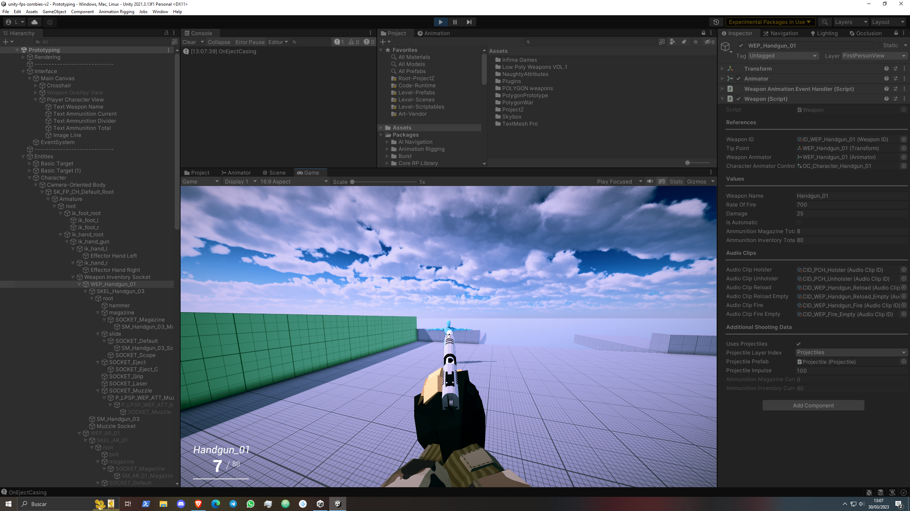

# Unity FPS Zombies

Unity Zombies Project, inspired by CoD Zombies, being developed as a test of my skills.

Currently in development, it's playable to the point that the player can shoot, damage, receive and spend points, as well as pass the round and all.

Possible/Missing features are:
- Implement more states for the AI state machine
- Models, animations and animation events for the zombies
- Improving character weapon animations
- Fixing the raycast firings (bullets work well)
- Implement temporal powerups
- Implement Pickable spawning system based on the number of zombies killed or the points collected
- All the Menus
- Improving the game flow
- Music and sound effects
- (Maybe Netcode)
